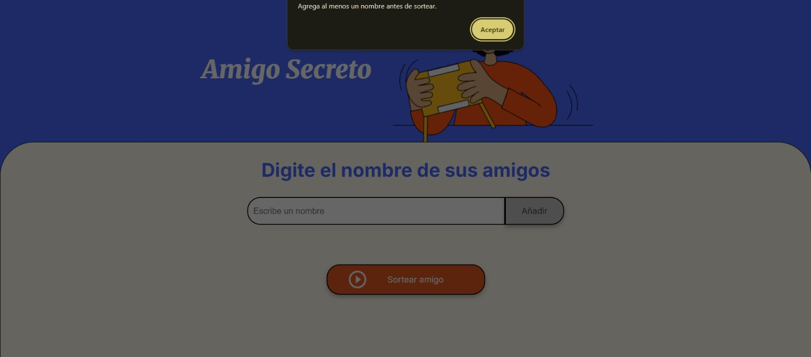

<h1>Lógica de Programación: Challenge Amigo secreto</h1>

Este proyecto implementa una aplicación web llamada “Amigo Secreto”, desarrollada con HTML, CSS y JavaScript, cuyo propósito es poner en práctica conceptos fundamentales de lógica de programación.

La aplicación permite a los usuarios ingresar nombres en una lista, validar las entradas, visualizar los amigos registrados y realizar un sorteo aleatorio para determinar quién será el “amigo secreto”.

Durante el desarrollo se aplicaron los siguientes conceptos:

<ol>
  <li>Variables y arrays para almacenar los nombres ingresados.</li>

  <li>Funciones para modularizar las acciones de agregar amigos, mostrar la lista y realizar el sorteo.</li>

  <li>Condicionales para validar que no se ingresen campos vacíos y asegurar que existan participantes antes de sortear.</li>

  <li>Bucles para recorrer y mostrar dinámicamente la lista de amigos en la interfaz.</li>

  <li>Manipulación del DOM para actualizar el contenido de la página con los resultados del sorteo.</li>
</ol>

El proyecto finalizado permite reforzar habilidades en lógica de programación, enfocándose en la resolución de problemas mediante JavaScript y consolidando la base necesaria para abordar proyectos más complejos en el futuro.

<h2>Descripcion de uso</h2>
<ol>

 <li>Primeramente, te encontraras con la pantalla inicial de la pagina web, donde te solicita ingresar los nombres de los participantes.</li>

 

 <li>Para agregar a los participantes del juego, necesitaras ingresar el primer nombre en la barra de texto que indica "Escribe un nombre". Luego clickear el boton de añadir. Realizar estos mismos pasos para cada nombre.</li>

 

 <li>Al añadir todos los nombres podras sortearlos al clickear el boton de "Sortear amigo". Posteriormente se mostrara el nombre del amigo secreto sorteado.</li>

 
</ol>

<h3>Nota</h3>

Al clickear el boton de "añadir" ubicado en el lado derecho de la barra de texto de "Escribir amigo" sin haber añadido ningun nombre a la barra de texto, aparecera una alerta que te indica "Por favor, inserte un nombre."

De igual manera sucede al clickear el boton de "Sortear amigo" sin haber añadido ningun nombre.

